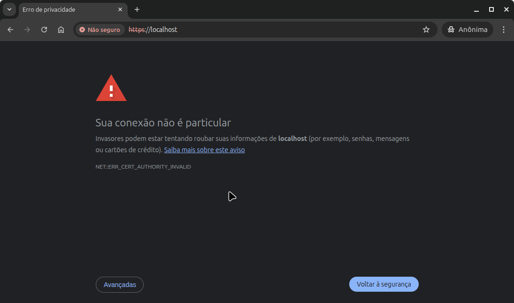
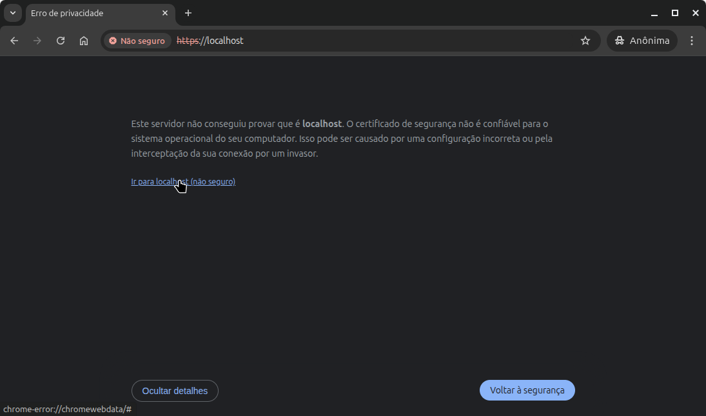
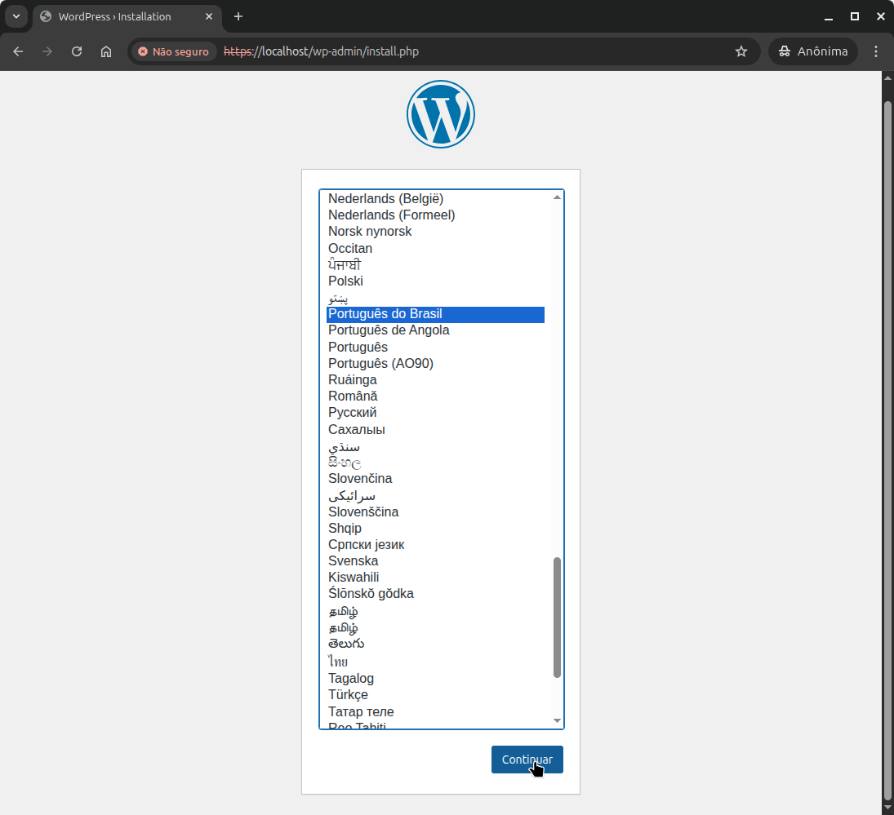
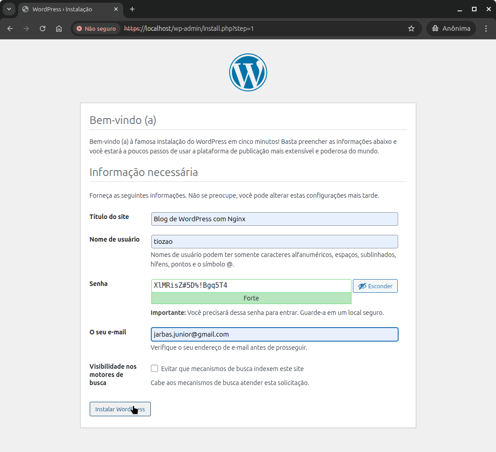
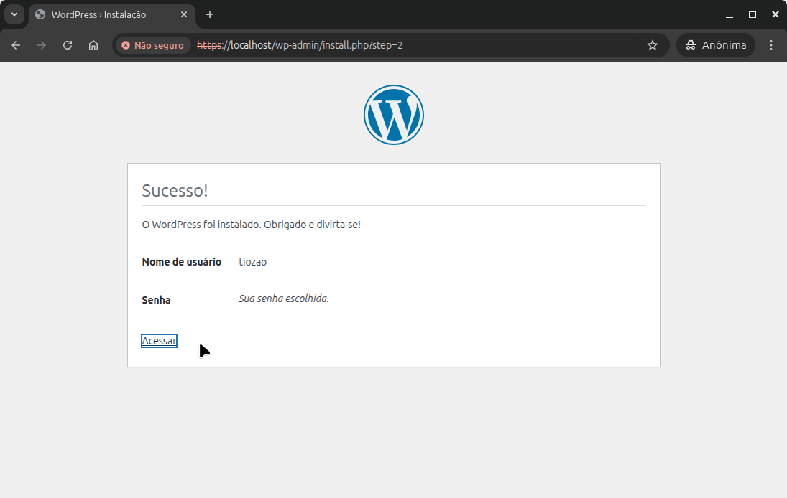
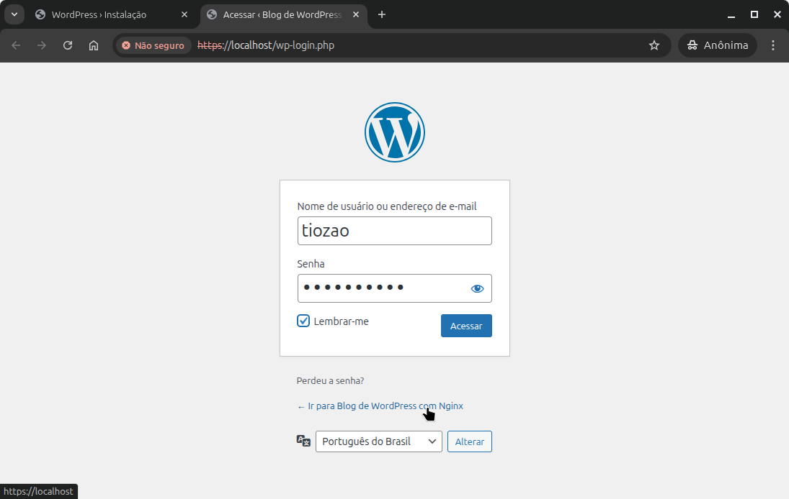
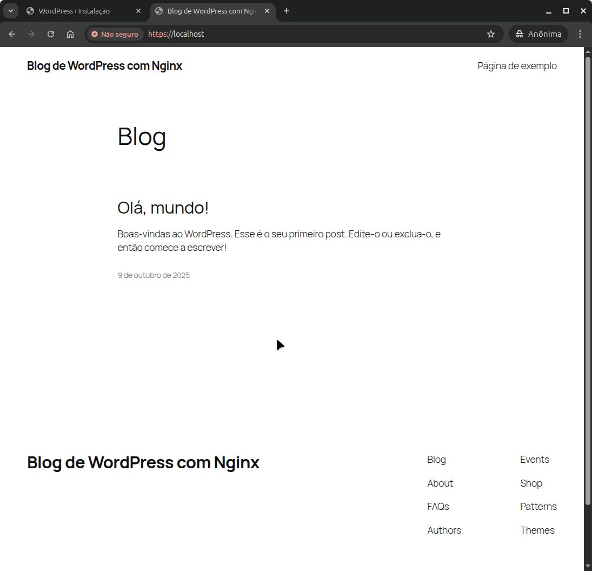

# Imagens Bitnami

Durante 18 anos, as [Imagens Bitnami](https://github.com/bitnami/containers) eram livres para uso sem requerer subscrição/pagamento.

Desde 28/Ago/2025 a maioria das imagens requerem subscrição. Se houve algum container rodando com imagens que foram afetadas, a mensagem é mostrada:
* NOTICE: Starting August 28th, 2025, only a limited subset of images/charts will remain available for free. Backup will be available for some time at the 'Bitnami Legacy' repository. More info at https://github.com/bitnami/containers/issues/83267

Essa decisão afetou diversos usuários que antes utilizavam as Imagens de forma livre.

No caso do WordPress, a imagem que eu utilizava https://hub.docker.com/r/bitnami/wordpress-nginx não está mais disponível de forma gratuita
* As últimas estão disponíveis em https://hub.docker.com/r/bitnamilegacy/wordpress-nginx
* Você ainda pode utilizar as outras últimas do https://hub.docker.com/u/bitnamilegacy (mais sem atualização)
* Nem adianta abrir uma issue relatando o problema causado https://github.com/bitnami/containers/issues/86874
* Ainda é possível utilizar https://hub.docker.com/r/bitnami/wordpress. Mas até quando?

# Imagens Oficiais

* Quais são as [Docker "Official Image"](https://github.com/docker-library/official-images#what-are-official-images)
* Como instanciar um WordPress do Zero em docker utilizando apenas imagens oficiais?

De acordo com https://br.wordpress.org/download/ (em 09/Out/2025) as recomendações são:
* PHP 8.3 ou superior,
* versão do MySQL 8.0 ou a versão do MariaDB 10.6 ou superior.

Então vamos utilizar as imagens abaixo:

* Banco de Dados: [mariadb:latest - versão 12](https://hub.docker.com/_/mariadb)
* WordPress: [wordpress:fpm - versão 6.8.3 ](https://hub.docker.com/_/wordpress)
* Servidor Web: [nginx:latest - versão 1.29.2](https://hub.docker.com/_/nginx) 
* Porquê Nginx ao invés do Apache?
  * Performance: - https://www.hostinger.com/br/tutoriais/nginx-vs-apache
  * Grandes sites: https://developer.wordpress.org/advanced-administration/server/web-server/nginx/

# Obtendo o código

* Basta um **git clone** básico:
```bash
git clone https://github.com/jarbelix/wordpress-nginx.git
cd wordpress-nginx
```
## Utilizando Certificados Digitais Auto-Assinados

Para o funcionamento seguro é fundamental que o tráfego entre o Browser e o Servidor Nginx seja criptografado.

Mesmo utilizando um **Self-Signed Certificate** não há como um **tcpdump** bisbilhoteiro **ler** o trafego.

## Gerando Certificados Auto-Assinados

Basta uma única linha de comando com o **openssl** para obter os arquivos de chave privada (**nginx.key**) e certificado (**nginx.crt**). Os arquivos nesse repositório foram gerados conforme abaixo:

```bash
openssl req -x509 -nodes -days 3650 -newkey rsa:2048 -keyout nginx.key -out nginx.crt -subj "/C=US/ST=State/L=City/O=Organization/CN=localhost"
```
* Fonte: https://ecostack.dev/posts/nginx-self-signed-https-docker-compose/


## Customizando com suas preferências

* O arquivo [docker-compose.yml](docker-compose.yml) pode ser editado para refretir suas preferências (portas expostas, versão das imagens, etc). Quando em produção, remova a entrada do volume **info.php** que serve apenas para validar se as variáveis PHP foram aplicadas corretamente. Optei por não comentar essa linha em meu ambiente de demonstrção, então veja https://wordpress.tiozaodolinux.com/info.php

* O arquivo [custom-nginx.conf](custom-nginx.conf) contém as configurações básicas do servidor Nginx

* O arquivo [custom-php.ini](custom-php.ini) contém as configurações de variáveis do PHP

## Subir o Stak (mais de um container simultâneo)
```bash
docker compose up -d
```

# Instalando e Configurando seu Wordpress

Acesse https://localhost ou o FQDN (ex: https://wordpress.tiozaodolinux.com) do seu site.

Seguir as orientações conforme prints abaixo:

* Alerta de conexão insegura



* Aceitar os riscos



* Escolha do Idioma



* Preencher com suas informações



* Instalação concluída



* Login na Área Administrativa



* Visualiando o Conteúdo Inicial


